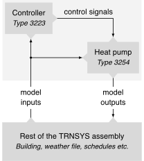

# Model variable capacity air-to-air heat pumps in TRNSYS
The TRNSYS Types 3254 and 3223 provided here aim to model single zone,
mini-split air-to-air heat pumps equipped with a variable speed comp­ressor.
The Type 3254 relies on performance maps to model heat pump performance,
and the Type 3223 is dedicated to control aspects (see figure below).
As of this version, the model is exclusively dedicated to
short time step simulations—ideally below 5 minutes.

## Features
- Heating and cooling mode operation 🔥 ❄️
- Compressor frequency modulation with a dedicated controller ⏦
- Defrost cycles in heating mode 🌦
- Sensible and latent cooling ♨️ 💧

## Installation instructions
*TBA*

## Support
A detailed documentation is available [here](https://vcaahp-model.readthedocs.io).
If you encounter bugs or are having problems, please open an issue in the
[issue tracker](https://github.com/polymtl-bee/vcaahp-model/issues)
and submit a minimal working example in the form of a deck file
to highlight what is not working.

You can ask questions about the model in the Q&A Discussions.
